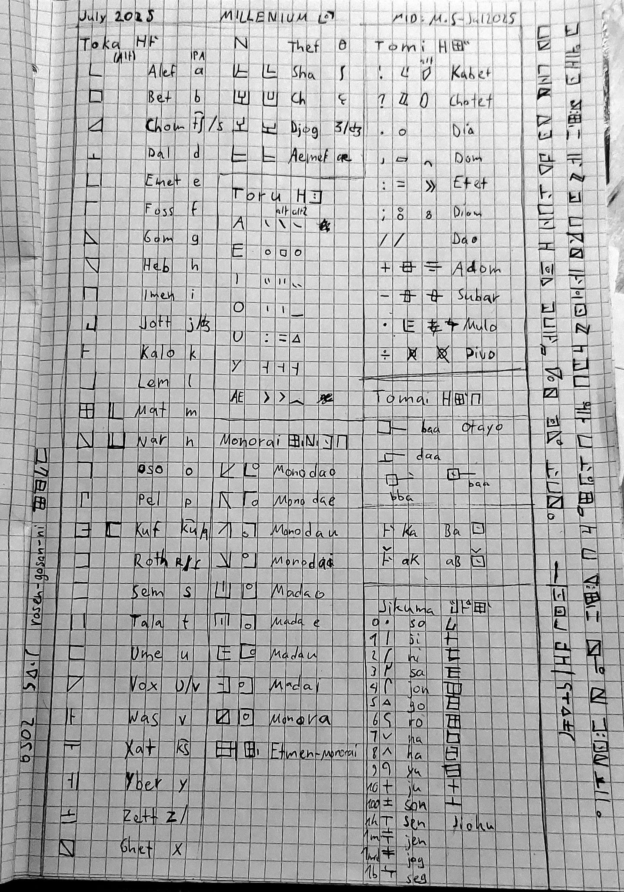

# MILLENIUM [FEB 26]

# TOKARA - Schriftsystem

1. Toku und Toru
2. Monorai
3. Tomi (Satzzeichen)
4. Jikuma (Zahlensystem)
5. Tomai (besondere Systeme)

---

*Deprecated Image of Tokara from JUL 25*

---

## 1. Toku und Toru

~~~

Es gibt 28 Grundlegende Toku (und 4-5 besondere Toku), dies sind die wichtigsten Schriftzeichen.

Um ein vokal an das Toku zu hängen fügt man ein Toru hinzu, die 6 vokale sind a,e,i,o,u
und y welches nur in speziellen fällen genutzt wird.

Es kann niemals ein Toru ohne Toku geben.

Man kann in bestimmten fällen anstatt Toru die Toku alternative nutzen. -> Wenn nicht genügend platz zum schreiben da ist oder in Nachrichten um ein lautes Aussprechen oder Schreien der Wörter darzustellen.

Die Toru a,e,i,u werden je nach angesagtem Monorai an das Toku gesetzt, beim Toru o und y werden alternative Schriftzeichen der Toku genutzt.

Die Toku werden durch Großbuchstaben, und die Toru als Kleinbuchstaben romanisiert.

~~~

## 2. Monorai

~~~

Um zu wissen wo man das Toru an das Toku plaziert gibt es die Monorai.

Wenn die 9 internen Monoraien nicht gelten, wird das Etmen-Monorai (etmen - "ausserhalb") genutzt.

~~~

## 3. Tomi (Satzzeichen)

~~~

Dies sind die offiziel anerkannten Toki.

Ausser dem Dia sind alle Tomi nicht wichtig für die Spache, sie sind Darstellungen und Hilfen.

Das Dia wird als trennung von Sätzen genutzt (so wie der punkt im Deutschen).

Das Kabel dient zur visuellen darstellung eines Ausrufs, da ausrüfe normalerweise ohne Satzzeichen gebildet werden.

Ähnlich wie das Kabel zeigt das Chotel eine Fragestellung.

Das Domel wird genutzt um Situationen oder Szenen innerhalb eines Satzes zu trennen (Ähnlich wie beim Komma).

Das Etel nutzt man ähnlich wie das Dia mit dem zusatz dass der folgende Satz den vorherigen erläutern bzw ausweiten soll, er bezieht sich somit auf den letzen Satz.

Als trennzeichen bei Aufzahlungen wird das Dao genutzt.

~~~

## 4. Jikuma (Zahlensystem)

|Zahlenwert|Zeichen 1|Zeichen 2|Lesung 1|Lesung 2|
|:---|:---:|:---:|:---:|:---:|
|0|||So|Soo|
|1|||Ji|Jishi|
|2|||Ni|Nito|
|3|||Sa|Sama|
|4|||Yo|Yoko|
|5|||Go|Gon|
|6|||Ro|Roku|
|7|||Na|Nan|
|8|||Ha|Haru|
|9|||Ku|Kiyu|
|10|||Ju|Ju|
|100|||Son|Son|
|1000|||Sen|Sen|
|10.000|||Juson|Juson|
|1.000.000|||Jen|Jen|
|1.000.000.000|||Jog|Jog|
|1.000.000.000.000|||Seg|Seg|

## 5. Tomai (besondere Systeme)

~~~
Es gibt mehrere besondere Systeme, doch nur das Otayo ist wirklich wichtig.
~~~

Das Otayo verlängert den letzten laut des Schriftzeichens bei:

-> Toku + Toru wird das Toru verlängert
-> Toku (AEIOUY) wird das Toku verlängert

---

### Yota

Das Yota wird als Hatschek (eng. caron) über dem Schriftzeichen geziechnet. Dadurch wird die aussprache des Zeichens umgekehrt (yo wird zu oy).

---

### Choukai

Bei Fremdwörtern oder Lautwörtern die dipthongs besitzen wird Choukai genutzt, es ermöglicht es an einem Toku eine verbindung aus zwei Toru zu befestigen.

Die Toru werden im Choukai von links nach rechts geordnet.

Es gelten die Monorai.

---

### Notore

Wenn man Namen schreibt kann man Notore nutzen um diese vom rest des Satzes abzutrennen, vor und nach den namen kommt jeweils ein langer vertikaler Strich.